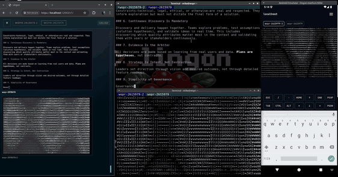
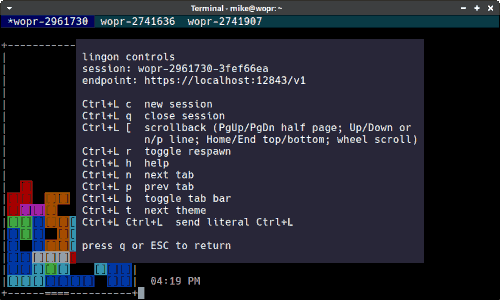

# Lingon


Lingon is a secure, multi-client terminal relay with a CLI, Web UI, and Android app.
It is built around four personas:

- **Interactive host (default CLI)**: runs a real terminal session and streams it to the relay.
- **Attach**: connects to a session (TUI or programmatic SDK) to view/control it.
- **Serve**: runs the relay server (HTTPS + WSS + Web UI).
- **Web UI**: browser-based client served by the relay.

The host/attach terminal UI paths use a full-framebuffer MVU runtime
(`internal/mvu`) as the canonical renderer and state-transition model.



## Quick start

### 1) Bootstrap config + TLS

```bash
lingon bootstrap
```

This creates a default config at `~/.lingon/config.yaml` and a TLS directory at
`~/.lingon/tls`. The Lingon config root defaults to `~/.lingon`; override it
with `-C/--config-dir` or `LINGON_CONFIG_DIR` when you want every default
config/data path rooted somewhere else. Paths inside the config are relative by
default (resolved against the config file location). Use `-c/--config` to write
one specific config file elsewhere, `--set` to override values, `--force` (or
`-f`) to overwrite, and `--regenerate-certificates` to rotate TLS assets.

Examples:

```bash
lingon bootstrap -c /app/config/config.yaml -s server.base=/lingon -s server.tls.dir=/app/certs
lingon bootstrap -f -c /app/config/config.yaml -s server.base=/lingon
lingon bootstrap -c /app/config/config.yaml --regenerate-certificates
lingon bootstrap -s server.tls.hostname=lingon.my.domain.tld -s server.listen=:8443
```

The last example generates a CA and server cert for `lingon.my.domain.tld`
(CN/SAN) and listens on all interfaces at port 8443. Typically you want to
change the listen address to something other than `127.0.0.1:...` to serve over
the network.

### 2) Create a user

```bash
lingon users add alice
```

By default Lingon generates a password and prints it along with the TOTP seed.
Use `--prompt` if you want to enter a custom password.

### 3) Start the relay server

```bash
lingon serve
```

By default this listens on `127.0.0.1:12843` with base path `/v1`.

### 4) Log in (client side)

```bash
lingon login -e https://localhost:12843/v1
```

Tokens are stored at `~/.lingon/auth.json` by default.
The file stores auth per normalized endpoint key, so switching `-e/--endpoint`
reuses the matching cached refresh/access tokens.

Log out from an endpoint (remote revoke + local token removal):

```bash
lingon logout -e https://localhost:12843/v1
```

### Endpoint selection

When `-e/--endpoint` is omitted, Lingon resolves the endpoint in this order:

1. `--endpoint`
2. explicitly configured `client.endpoint` (config file or `LINGON_CLIENT_ENDPOINT`)
3. single stored endpoint in `~/.lingon/auth.json` when the command is using stored auth
4. built-in default endpoint (`https://localhost:12843/v1`)

Important exceptions:

- `lingon login` never depends on `auth.json`; without `--endpoint` it uses the configured endpoint or the built-in default.
- Explicit `--token` / `--access-token` disables auth-file endpoint inference. Those flows use `--endpoint`, configured `client.endpoint`, or the built-in default.
- Share tokens with an embedded endpoint use that embedded endpoint unless `--endpoint` is explicitly passed. Bare share tokens use `--endpoint`, configured `client.endpoint`, or the built-in default.
- If stored auth contains multiple endpoints, auto-inference fails with an ambiguity error until you pass `--endpoint` or set `client.endpoint`.

### Config root and derived paths

By default Lingon stores config, auth, TLS assets, server data, local headless
state, and logs under `~/.lingon`. It does not use `XDG_CONFIG_HOME` for this
default. Use `-C/--config-dir` or `LINGON_CONFIG_DIR` to move the whole Lingon
root for commands and tests:

```bash
lingon --config-dir /tmp/lingon-dev serve
LINGON_CONFIG_DIR=/tmp/lingon-dev lingon login
```

The explicit `-c/--config` flag still points at a single config file. It does
not, by itself, move other default paths unless those values are relative in
that config file or you also set the config root.

### 5) Start a host session (default CLI)

```bash
lingon -e https://localhost:12843/v1 -s my-session

# Or more commonly: use config and no -s (will generate a session ID)
lingon
```

Lingon uses prefix keystroke `Ctrl+l` as *command introducer*, see `Ctrl+l h` (`ctrl+l` followed by `h`) for help.



### 6) Attach from another terminal

```bash
lingon attach -e https://localhost:12843/v1 my-session
```

### 7) Open the Web UI

```text
https://localhost:12843/v1/
```

The Web UI is served by the relay at the base path.

## Personas and workflows

### Rendering architecture (CLI TUI)

Lingon CLI host/attach rendering follows a single MVU pipeline:

- **Model**: typed runtime state (`mvu.State`) for tabs, overlays, connectivity, help, wall, scrollback status.
- **Update**: typed actions via `Runtime.ApplyAction(...)`.
- **View**: full-framebuffer composition + delta emission from composed snapshots.
- **Effects**: overlay/tab timers scheduled through `mvu.EffectScheduler`.

This replaced the previous hybrid/non-framebuffer compositor implementation.
`internal/compositor` has been removed; new TUI behavior should integrate
through `internal/mvu`.

### Interactive host (default command)

Run a terminal host that becomes a shared session:

```bash
lingon -e https://relay.example.com/v1 -s prod-shell
```

Interactive host options (selection):

- `-e, --endpoint` relay endpoint (https/wss base URL; assumes `https://` if omitted)
- `-C, --config-dir` Lingon config root directory (default `~/.lingon`; env `LINGON_CONFIG_DIR`)
- `-s, --session` session id
- `--token` access token (overrides stored auth)
- `--auth-file` path to auth file
- `--shell` override login shell path
- `--cols`, `--rows` terminal size
- `--scrollback-lines` scrollback lines
- `--term` TERM value for the PTY
- `-r, --respawn` respawn the shell on exit
- `-o, --offline` start offline; toggle relay publishing with `Ctrl+l o`
- `--hostname-only` show hostname-only connect/disconnect banners
- `--theme` TUI chrome theme (`lingon themes`)
- `--disable-desktop-notifications` disable best-effort local desktop notifications for inactivity walls
- `-k, --insecure` skip TLS verification
- `--log-file` client log file path (empty disables)
- `--trace`, `--trace-file` write a JSONL trace

### Headless local PTY host

Run a detached local PTY host (no local interactive host TUI), accessible through
local unix-socket attach/send/sessions commands:

```bash
lingon -x -s local-shell
```

You can also invoke the same mode by binary name:

```bash
lingonx -s local-shell
```

(`lingonx` includes symlink invocations where `argv[0]` basename is `lingonx`.)

Headless local mode notes:

- `-x, --headless` switches root/attach/send/sessions to local headless mode.
- Metadata and sockets are stored under `<config-dir>/headless/`.
- `lingon attach -x` works even when relay publishing is offline/disconnected.
- In `attach -x`, `Ctrl+l o` is local-host control and is allowed.

### Attach

Attach to a session over a TUI client:

```bash
lingon attach -e https://relay.example.com/v1 prod-shell
```

Attach to a share token:

```bash
lingon attach --token <token>
```

If the share token embeds an endpoint, attach uses it automatically unless you
also pass `--endpoint`. Bare share tokens do not infer from `auth.json`; they
use `--endpoint`, configured `client.endpoint`, or the built-in default.

Attach options (selection):

- `-e, --endpoint` relay endpoint (https/wss base URL; assumes `https://` if omitted)
- `-C, --config-dir` Lingon config root directory (default `~/.lingon`; env `LINGON_CONFIG_DIR`)
- `-x, --headless` attach via local headless unix socket sessions
- `-t, --token` share token for anonymous attach
- `--access-token` access token for authenticated attach
- `--request-control` request controller lease on connect
- `--pick` interactively pick a session
- `--hostname-only` show hostname-only connect/disconnect banners
- `--theme` TUI chrome theme (`lingon themes`)
- `--disable-desktop-notifications` disable best-effort local desktop notifications for inactivity walls
- `-k, --insecure` skip TLS verification
- `--auth-file` path to auth file
- `--log-file` client log file path (empty disables)
- `--trace`, `--trace-file` write a JSONL trace

### Wall messages and inactivity alerts

Broadcast a wall message to your active sessions:

```bash
lingon wall hello from ops
lingon wall --quiet hello from automation
```

Wall messages are delivered through the relay to connected clients. CLI host and
attach clients show wall messages in the TUI. Local interactive host and attach
clients can also emit best-effort desktop notifications for inactivity walls;
disable that per command with `--disable-desktop-notifications` or in config
with `terminal.disable_desktop_notifications: true`.

`Ctrl+l w` cycles wall inactivity levels for the active session. Configure the
cycle with `--wall-inactive-after` or `terminal.wall_inactive_after`; the
default is `2m,5m,15m`. The relay uses `--wall-timeout` / `server.wall.timeout`
for wall banner display duration.

### Serve

Run the relay server:

```bash
lingon serve
```

Common flags:

- `--listen` listen address (default `127.0.0.1:12843`)
- `--base` base path (default `/v1`)
- `--data-dir` data directory
- `--users-file` user store
- `--connect-limit-count`, `--connect-limit-burst`, `--connect-limit-window`, `--connect-limit-disable` global connection rate limiting
- `--replay-history-bytes` replay history retained for reconnecting clients
- `--tls-mode` `auto|bundle|acme`
- `--tls-dir` local TLS directory (auto mode)
- `--tls-bundle` PEM bundle file (bundle mode)
- `--tls-hostname` hostname for ACME or server cert
- `--tls-cache-dir` ACME cache directory
- `--wall-timeout`, `--wall-inactive-after` wall banner behavior
- `-n, --no-banner` remove login-page branding from served Web UI assets

**Reverse proxy note:** WebSocket endpoints (`.../ws/...`) must be proxied to
the relay over HTTP/1.1. If your reverse proxy negotiates HTTP/2 to the
upstream, force HTTP/1.1 for the WebSocket routes (or disable h2 to the relay).

### Web UI

The Web UI is served by the relay server at the base path. Login uses the same
user credentials as the CLI. You can also attach directly from the login form
using a share token (token mode disables username/password/TOTP fields). The
existing URL flow still works via `?token=<share-token>`. Session switching,
sharing, resize control, and themes are all accessible from the menu.

### Android app

The Android app provides a native client with session switching, sharing,
cert management, UI themes, per-session zoom, smooth scrollback panning, and
optional background wall notifications.

Build and run from the root:

```bash
make android-sdk
make android-avd PRESET=medium
make android-emulator
make android-build
make android-install
```

Or, directly from `android/`:

```bash
make -C android sdk
make -C android avd PRESET=medium
make -C android emulator
make -C android build
make -C android install
```

The Android `Makefile` includes targets for release builds, AVD setup, and
integration tests.

Android wall behavior:

- Foreground wall messages are shown in-app and do not post Android system notifications.
- Background wall notifications can be enabled from the menu; Android then keeps
  a foreground service active while backgrounded and posts relay wall messages
  as system notifications.
- The app polls for background wall messages only while backgrounded.

## Known caveats and parity notes

- The CLI no-flicker/tab-overlay invariants are enforced by integration and
  architecture tests in `internal/session`, `internal/attach`, and `internal/mvu`.
- Web UI and Android do not use the `internal/mvu` renderer directly; they use
  the same relay/session protocol but maintain independent UI renderers.
  Minor visual/timing differences across clients can still occur.
- In host mode, switching between local and remote tabs intentionally resets
  render baseline in some paths (to avoid composing against incompatible prior
  snapshots), so a full repaint on those transitions is expected.

## TLS and certificates

Lingon supports three server TLS modes:

- `auto`: generates and stores a local CA and server cert in `tls.dir`.
- `bundle`: loads a PEM bundle (cert + key) from `tls.bundle`.
- `acme`: uses ACME (TLS-ALPN-01) with `tls.hostname` and `tls.cache_dir`.

### ACME mode

When `server.tls.mode` (or `serve --tls-mode`) is set to `acme`, Lingon uses
ACME TLS-ALPN-01 to obtain and renew certificates automatically. This requires:

- `server.tls.hostname` / `--tls-hostname` (public DNS name to request certs for).
- `server.tls.cache_dir` / `--tls-cache-dir` (directory for cert/issuer cache).

The relay must be reachable at the configured hostname over TLS for ACME to
validate the domain (typically on port 443). Certificates are cached under
`tls.cache_dir` and renewed automatically by the ACME manager.

### Export the CA for clients

If you use `auto` mode, export the CA and trust it on clients:

```bash
lingon tls export -o ./lingon-ca.pem
```

Then import the CA into your OS or browser trust store. This is required for
Web UI and Android unless you use `--insecure`.

### Insecure mode (not recommended)

You can skip TLS verification with `-k/--insecure` on client commands. This is
useful for quick local testing only.

## Configuration (excerpt)

```yaml
server:
  listen: 127.0.0.1:12843
  base: /v1
  data_dir: .
  users_file: users.json
  tls:
    mode: auto
    dir: tls
    cache_dir: tls/cache
client:
  endpoint: https://localhost:12843/v1
  auth_file: auth.json
terminal:
  term: xterm-256color
  scrollback_lines: 5000
  disable_desktop_notifications: false
  wall_inactive_after: 2m,5m,15m
```

Relative paths are resolved relative to the config file. `~` is not expanded in
config values; use absolute paths or relative paths instead.

## CLI reference (high level)

- `lingon bootstrap` - create config + TLS assets
- `lingon serve` - run relay server
- `lingon login` - authenticate and cache tokens
- `lingon` - start an interactive host session (default command)
- `lingon -x` / `lingonx` - start a detached local headless PTY host session
- `lingon attach` - attach to a session
- `lingon attach -x` - attach to a local headless PTY session
- `lingon send` - send input to a session
- `lingon send -x` - send input to a local headless PTY session
- `lingon wall` - broadcast a wall message to active sessions
- `lingon users` - manage users
- `lingon sessions` - list sessions
- `lingon sessions -x` - list local headless PTY sessions
- `lingon detach <session-id>` - force-stop a local headless PTY session
- `lingon share` - create/revoke share tokens
- `lingon tls` - manage TLS assets
- `lingon completion` - generate shell completion scripts
- `lingon version` - print version/build metadata

Run `lingon <command> --help` for details.

## Makefile

Top-level `Makefile` targets:

- `make build` - build `bin/lingon`
- `make test` - run unit tests
- `make test-webui` - run Web UI integration tests
- `make test-android` - run Android integration tests
- `make lint` - go vet + golint + golangci-lint
- `make release` - build binary + Android APK + zip bundle

## SDK

The SDK lives in the `lingon` Go package and mirrors CLI functionality.
See `doc.go` for examples.

> ### Trivia
>
> Lingon is not Klingon. The name comes from the idea that the terminal is a
> place where humans *talk to machines*, using a shared *lingo* the machine
> understands. Lingon makes that lingo usable across *n* platforms and *n*
> simultaneous clients—whether they act as viewers or controllers.
